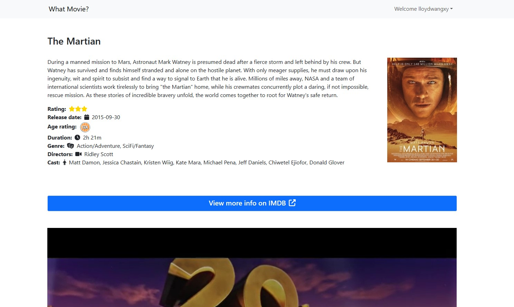

# what-movie

This web app allows users to browse movies now showing in or coming soon to cinemas. They can save their favourite show times to their accounts.

## Table of Contents

- [what-movie](#what-movie)
  - [Table of Contents](#table-of-contents)
  - [Features](#features)
  - [Getting Started](#getting-started)
    - [Prerequisites](#prerequisites)
    - [Installation](#installation)
  - [Usage](#usage)
  - [Contributing](#contributing)

## Features

- ReactJS Frontend
- Python Flask Backend
- PostgreSQL Database
- JWT authentication
- MovieGlu API Sandbox

## Getting Started

### Prerequisites

- Some Python, JS, SQL and Docker knowledge
- Docker (install [here](https://docs.docker.com/get-docker/))

### Installation

1. Within `what-movie-server/what_movie_server`, there is a `.env.example` file, create a `.env` file and follow the keys that need to be filled in
2. The `PROD_DATABASE_URI` variable does not need to be filled for local setup. `SECRET_KEY` variable can be created using `os.urandom(24)` in `python`. The rest can be found by creating a MovieGlu account [here](https://developer.movieglu.com/). Use the credentials in the email and fill it up.
3. Ensure that you are at the root folder (`what-movie`)
4. Run `./scripts/setup_local.sh`
5. View the project at `http://localhost:3000`

## Usage

1. First sign up and login to the site.

2. View the movies that you would like to watch and click `View more info`

3. View the details of the movie

3. View the showtimes of the movie

4. If you like the showtime, click on it, and view your liked showtimes on the `View favourites` button at the navbar

## Contributing

Explain how others can contribute to your project. Include guidelines for submitting bug reports, feature requests, or pull requests.
